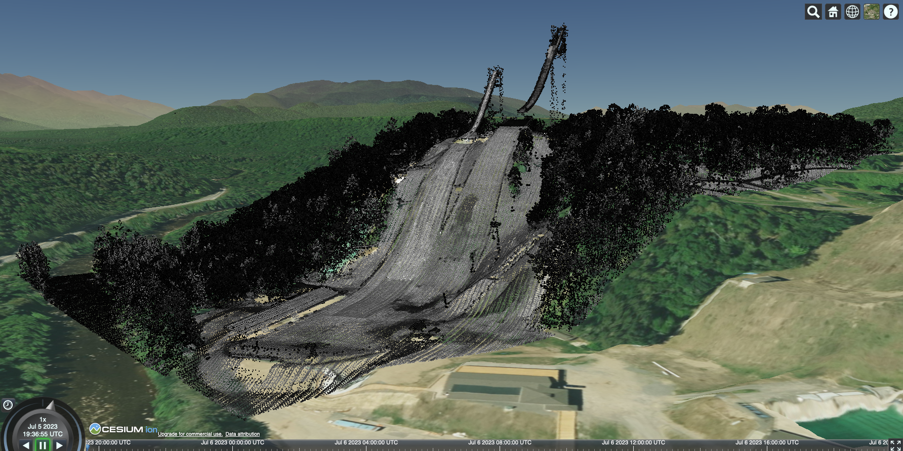

# viz-points
Python package for post-processing point-cloud data for 3D visualization

## Repository contents

- [notebooks/](notebooks/) contains the simplified and annotated Jupyter Notebook version of the LiDAR processing workflow
- [pdgpoints/](pdgpoints/) contains the application code comprising the library

## Installation

Requirements:
- [py3dtiles](https://gitlab.com/oslandia/py3dtiles) (Oslandia versions after [522ce61a](https://gitlab.com/Oslandia/py3dtiles/-/blob/522ce61a0c2cbeb496ba4862e14477bb941b23a3/py3dtiles/merger.py))
- rapidlasso [las2las](https://rapidlasso.com/lastools/las2las/) and [lasinfo](https://rapidlasso.com/lastools/lasinfo/) post-November 2022 (rapidlasso [precompiled Windows](https://github.com/LAStools/LAStools/blob/master/README.md#links) or included [linux binary](https://rapidlasso.de/release-of-lastoolslinux/))

Visualization requirements:
- A tool that can display 3dtiles data, such as [Cesium](https://cesium.com)

### Unix installation example

Remember to set up and activate your virtual environment before proceeding.

```bash
# install Oslandia py3dtiles
pip install git+https://gitlab.com/Oslandia/py3dtiles.git@68cdcd9080994d38614d3aa5db75cea2456298cf
# get and install this software
git clone https://github.com/PermafrostDiscoveryGateway/viz-points.git
cd viz-points
pip install .
# test your installation
tilepoints-test
```

## Usage

This software is designed to be used either as a command line tool or as a Python package.

### Command line usage

**Command syntax:**
```
tilepoints [ OPTIONS ] -f /path/to/file.las
```

**Required argument:**
```
    -f file.las | --file=/path/to/file.las
            specify the path to a LAS or LAZ point cloud file
```

**Options:**
```
    -h | --help
            display the help message
    -v | --verbose
            display more informational messages
    -c | --copy_I_to_RGB
            copy intensity values to RGB channels
    -m | --merge
            merge all tilesets in the output folder (./3dtiles)
    -a | --archive
            copy original LAS files to a ./archive folder
    -s X | --rgb_scale=X
            scale RGB values by X amount
    -z X | --translate_z=X
            translate Z (elevation) values by X amount
```

### Python usage

**Python example:**
```python
from pdgpoints.pipeline import Pipeline

p = Pipeline(f='/path/to/file.laz',
             intensity_to_RGB=True,
             merge=True,
             archive=False,
             rgb_scale=4.0,
             translate_z=-8.3,
             verbose=False)
p.run()
```

### Visualizing the data in Cesium

You can view the output tiles in a Cesium environment. For steps for how to visualize the tiles with a local Cesium instance, see the [documentation here in pdg-info](https://github.com/julietcohen/pdg-info/blob/main/05_displaying-the-tiles.md#option-1-run-cesium-locally).



More info on the above test dataset [here](pdgpoints/testdata/README.md).

Below is an example of the `cesium.js` file that will display a 3dtiles tileset at `./3dtiles/tileset.json` (you will need your own access token):


```javascript

function start(){// Your access token can be found at: https://cesium.com/ion/tokens.

  Cesium.Ion.defaultAccessToken = "YOUR-TOKEN-HERE"

  const viewer = new Cesium.Viewer('cesiumContainer');

  const imageryLayers = viewer.imageryLayers;

  var tileset = new Cesium.Cesium3DTileset({
    url: "3dtiles/tileset.json",
    debugShowBoundingVolume: true,
    debugShowContentBoundingVolume: false,
    debugShowGeometricError: false,
    debugWireframe: true
  });

  viewer.scene.primitives.add(tileset);

  window.zoom_to_me = function(){
    viewer.zoomTo(tileset);
  }

  tileset.readyPromise.then(zoom_to_me).otherwise(error => { console.log(error) });
}

start()
```