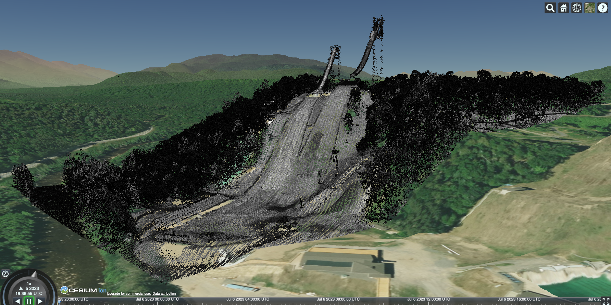

# Test data

Data is from the [USGS Lidar Point Cloud NY Cl-Ess-LChamp-P2 2014](https://portal.opentopography.org/usgsDataset?dsid=USGS_LPC_NY_Cl_Ess_LChamp_P2_2014_LAS_2016)
and shows the Olympic Jumping Complex in Lake Placid, NY, USA (shown below).

